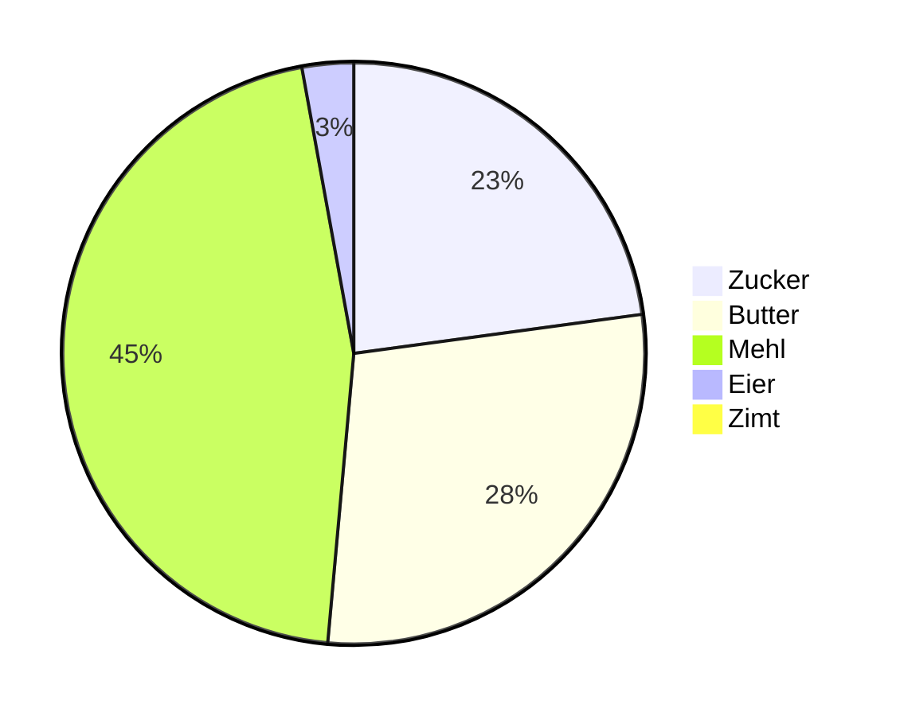
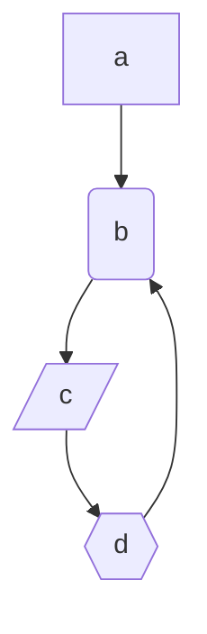
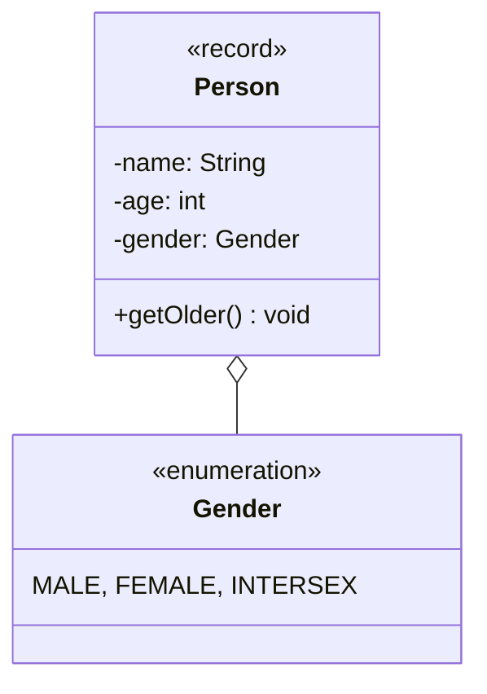

# Horizontale Linien

---

# Fußnoten

Markdown [^1]

[^1]: Eine einfache Auszeichnungssprache

# Mermaid Diagramme

**Kuchendiagramme**

```mermaid
pie
   "Zucker" : 200
   "Butter" : 250
   "Mehl"   : 400
   "Eier"   : 25
   "Zimt"   : 5
```

**Flussdiagramme**

```mermaid
flowchart
   a[a]
   b(b)
   c[/c/]
   d{{d}}
   a --> b
   b --> c
   c --> d
   d --> b
```

**UML-Klassendiagramme**

```mermaid
classDiagram
   Person o-- Gender
   class Person {
      <<record>>
      -name: String
      -age: int
      -gender: Gender
      +getOlder() void
   }
   class Gender {
      <<enumeration>>
      MALE, FEMALE, INTERSEX
   }
```
 
